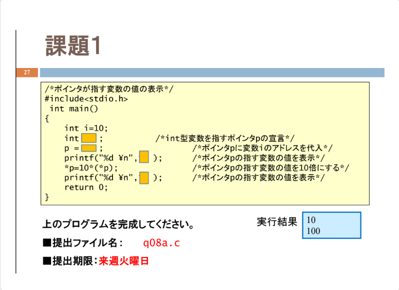
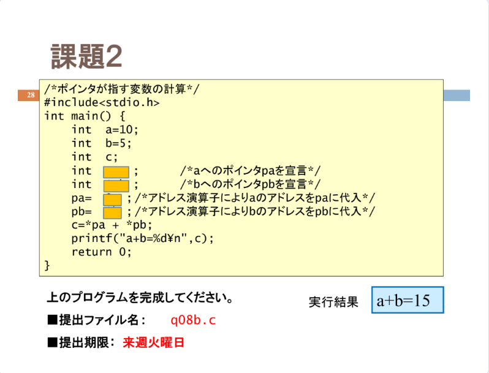

# 情報処理演習

情報処理演習のコードを保存しています。
メインはgithubの練習。


## 環境
使用環境は以下のとおりです。
- OS: WSL2 (ubuntu)
- Compiler: GCC 13.3.0

## 使い方
Cファイルは次のようにコンパイルできます。

```bash
gcc q01.c -o q01.out
```

math.hライブラリを使用している際はコンパイル時に-lm引数を指定してください。
```bash
gcc q01.c -o q01.out -lm
```


# 問題一覧

## q01
<br>
[q01.c](src/q01.c)

## q02
<br>
[q02.c](src/q02.c)

## q03a
<br>
[q03a.c](src/q03a.c)

## q03b
<br>
[q03b.c](src/q03b.c)

## q04a
<br>
[q04a.c](src/q04a.c)

## q04b
<br>
[q04b.c](src/q04b.c)

## q05a
<br>
[q05a.c](src/q05a.c)

## q05b
<br>
[q05b.c](src/q05b.c)

## q06a
<br>
[q06a.c](src/q06a.c)

## q06b
<br>
[q06b.c](src/q06b.c)

## q07a
<br>
[q07a.c](src/q07a.c)

## q07b
<br>
[q07b.c](src/q07b.c)

## q08a
<br>
[q08a.c](src/q08a.c)

## q08b
<br>
[q08b.c](src/q08b.c)

## q09a
<br>
[q09a.c](src/q09a.c)

## q09b
<br>
[q09b.c](src/q09b.c)


## q10
<br>
[q10.c](src/q10.c)

## q11
<br>
[q11.c](src/q11.c)